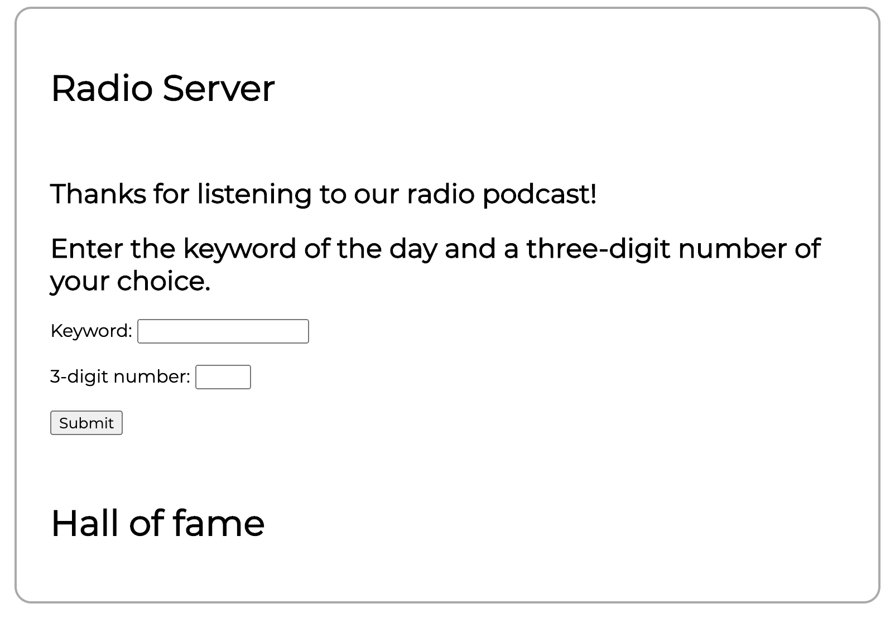
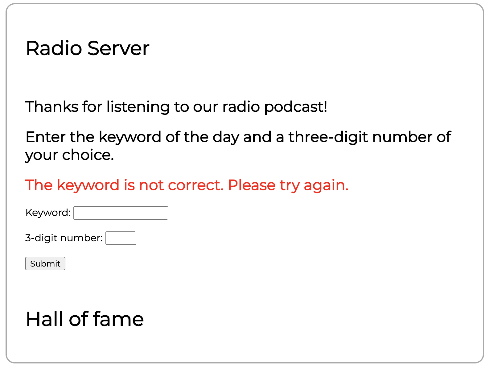
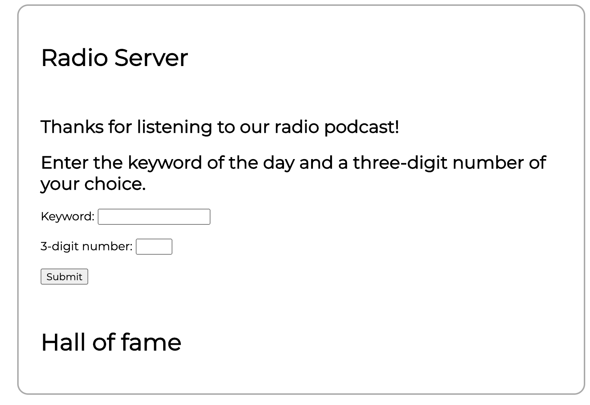
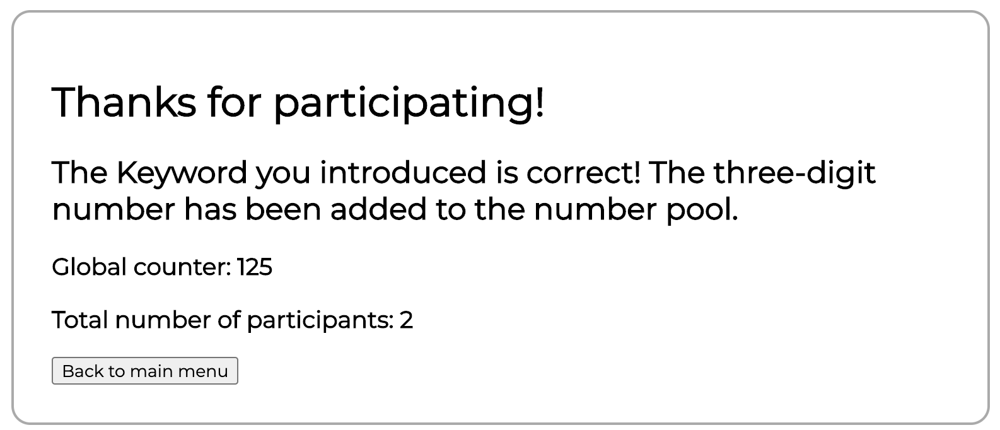
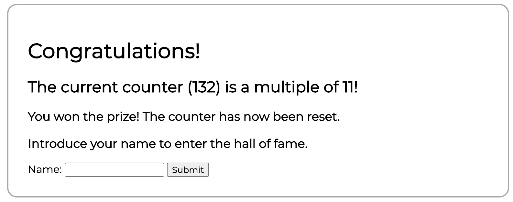
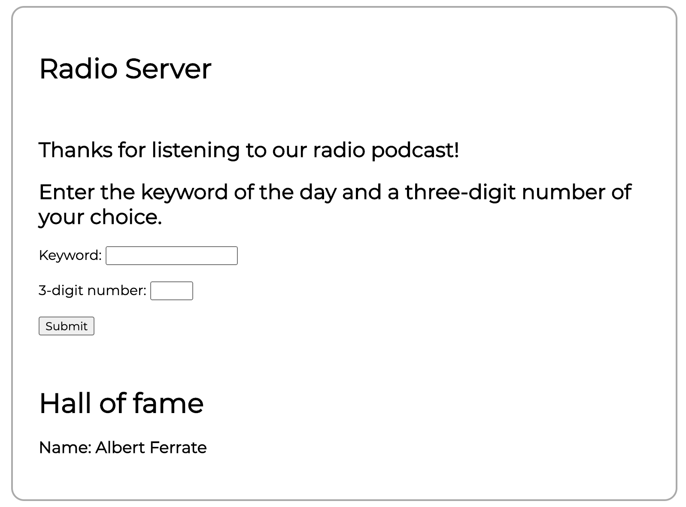

# Lucky Call

## Installation
Create a virtual environment and run the command `pip install -r requirements.txt`.

## Run
In order to run the app, run the command `python app.py`.
The app will be running at `http://127.0.0.1:5000/`.

## Example run
Initially, the keyword is theoretically distributed via a radio emission. In this example, the keyword is `i_love_python`. The followers would then access the server, and this would be the initial page: 

If the user now tries to introduce a non-correct keyword, this page would appear: 

Only once the correct keyword is introduced, the introduced 3-digit number is stored (only number between 0 and 999 are accepted), and the following page appears. In this particular example, the user number was `123` and since this is the first user, the total number of participants is `1`. 

At this point, only for commodity purposes, the main menu can be accessed using the `Back to main menu` button.  

A different user could now enter the page and introduce a different 3-digit number. This second user used the correct keyword and the number `2`. The following page pops up: 

As expected, now the displayed Global counter is the previous `123` plus the just introduced `002`, which equals `125`. Additionally, the total number of participants is now `2`.  

If a user would now introduce the correct keyword and the number `007`, the following page would appear. 

Since `132` is a multiple of 11, this user is now selected to win the prize. Additionally, his name can be stored to be displayed in the Hall of Fame. In this particular example, the chosen name was `Albert Ferrate`. 

As we can see, the main page now displays the names of the previous winners. 

The json document containing the information about the total number of participants and the global sum (`counter.json`) is reset, and the document containing information about the winners list (`winners.json`) is also updated. 

At this point, another user could participate in the contest and win the prize again. 

## Specifications
This solution is able to recover the total number of participants, the global sum and the winner list in case of a system failure. 

## Development Time 
The main application was developed in around three hours, and the README.md file was created in 45 minuted aprox. 

## Improvement Potential
There are many ways in which this exercice could be improved. Some of the main points could be the following: 

1) Create a better looking web design. 
2) Add a functionality to restrict each user to only one attempt at the contest. 
3) Add more complex functionallities to the server. 

## Fairness of the contest
This contest is not specially fair, since one user could participate several times. Additionally, a user could easily discover the algorithm behind the winning criteria (that the overall sum is a multiple of 11) and take profit of it. 

